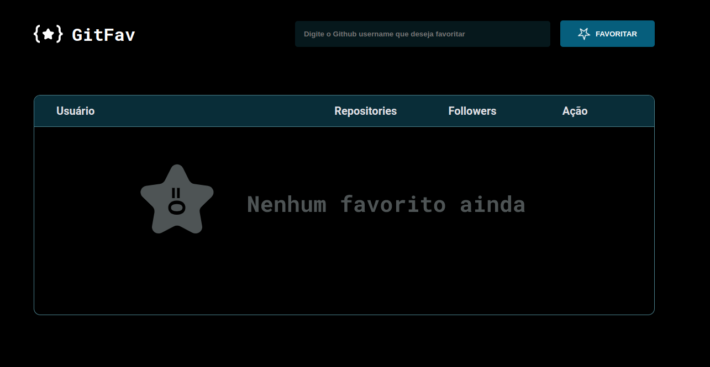

# 🔗 <a href="https://rodrigoluigi.github.io/Github-Favorites/">**GitFav**</a>

### 📌 Projeto de uma aplicação para buscar dados de usuários do Github e exibi-los em uma tabela com base em layout do figma.

#   _**O que desenvolvemos neste Projeto?**_

 Foi desenvolvido uma página em HTML, CSS, e JavaScript. Trabalhamos conceitos de POO (programação orientada a objetos) , modulação do JavaScript, , funções assincronas (asyc / await), Promises, Classes , herança e o que é polimorfismo, imutabilidade de dados, tratamentos de erros de aplicação utilizando métodos try/catch e throw, e armazenamento de dados em localStorage.

-  Tags semânticas
-  Acessibilidade
-  Media Queries (responsivo)
-  Animation
-  Modulação do JavaScript (ES6 MODULES)
-  POO
-  Classes
-  Herança
-  Polimorfismo
-  Fetch API
-  Assincronismo (async/await)
-  Promises
-  try/catch e throw
-  LocalStorage
-  Refatoração
-  Clean-code

| **Fontes** |
| ----------------- | 
| 🔗 **[Roboto - Google Fonts](https://fonts.google.com/specimen/Roboto)** |
| 🔗 **[Roboto Mono - Google Fonts](https://fonts.google.com/specimen/Roboto+Mono)** |
    

| **Cores**               |                                                 |
| ----------------- | ---------------------------------------------------------------- |
|  #000000 |  #E1E1E6 |      
|  #ffffff    |  #06181C | 
|  #065E7C    |  #092D38 | 
|  #4A808C    |  #ff0000 |

## 📚 Stack utilizada

  
  
  
  

## Screenshots

